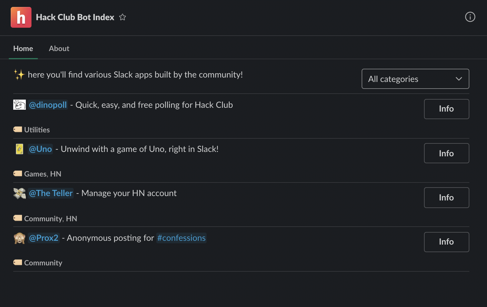

# Hack Club Bot Index



## Adding your app

Have you built an amazing Slack app, and want to add it? Just open a pull request to [apps.yaml](apps.yaml), adding your app to the `apps` array with the following fields:

```yaml
# Your app's name
name: dinopoll

# The user ID of the bot. Optional if your app doesn't have a bot.
# Find this by typing `/info @mybot` in Slack
bot_id: U01RR8KDEPQ

# Short, one-sentence description of what your app does
description: "Quick, easy, and free polling for Hack Club"

# A list of categories your app is in. Please update the top-level `categories` field if adding a category.
categories:
  - Utilities

# Link to your app's code repository (GitHub or otherwise)
repository: https://github.com/cjdenio/dinopoll

# Unless this app is maintained by a user group, this is <@U_MY_ID>.
# Find your user ID by typing `/sdt whoami` in Slack
maintainer: <@U013B6CPV62>

# A custom emoji that best represents your app, without colons
emoji: confused-dino

# A quick instruction on how to get started with this app. May span multiple paragraphs if needed, and supports Slack-compatible Markdown.
getting_started: |
  To create a poll, just run `/dinopoll` in the channel that you'd like to share the poll in!
```
